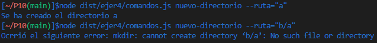

## Introducción
En esta práctica realizaremos 4 ejercicio en TypeScript utilizando node y algunas librerías, además intentaremos respetar los `principios SOLID`, crearemos el directorio adecuado para desarrollar proyectos en TS y utilizaremos herramientas como `EsLint` para el estilo del código según `Google` en nuestro caso, `TypeDoc` para la generación de la documentación del código de nuestro proyecto, `Mocha` y `Chai` para la creación de pruebas que nos permitiran llevar acabo el desarrollo `TDD` y multiples `github actions` como la de `Coveralls` y `Sonar`.

## Primeros pasos
Lo primero que tendremos que hacer es fsmiliarizarnos con el [API de callbacks proporcionada por Node.js para interactuar con el sistema de ficheros](https://nodejs.org/dist/latest-v18.x/docs/api/fs.html#callback-api) y con el [API asíncrona proporcionada por Node.js para crear procesos](https://nodejs.org/dist/latest-v18.x/docs/api/child_process.html#asynchronous-process-creation) y, en concreto, con la función `spawn`.

## Ejercicio 1.
En este ejercicio simplemente tendremos que ejecutar el código que nos ha proporcionado el profesor y describir la traza que realiza el programa de forma detallada.

- Pila de llamadas:
1.
```typescript
if (process.argv.length !== 3) {
  console.log('Please, specify a file');
}
```

2.
```typescript
if (process.argv.length !== 3) {
  console.log('Please, specify a file');
}
```

3.
```typescript
const filename = process.argv[2];
```

Llegados a este punto nos encontramos con una función que no pertenece a JS ni al motor V8, sino que es implementada por Node.js, es por esto que se registra un evento en el API de Node.js
- Registro de eventos API:
```typescript
access(filename, constants.F_OK, (err) => {
    if (err) {
      console.log(`File ${filename} does not exist`);
    } else {
      console.log(`Starting to watch file ${filename}`);

      const watcher = watch(process.argv[2]);

      watcher.on('change', () => {
        console.log(`File ${filename} has been modified somehow`);
      });

      console.log(`File ${filename} is no longer watched`);
    }
  });
```

Cuando finalice el evento correspondiente pasará a la cola de manejadores. En este caso el evento correspondiente es ver si el archivo `filename` existe. En la cola de manejadores esperará hasta que la pila de llamadas esté vacía y cuando lo esté pasará a la pila de llamadas y será ejecutado.
- Pila de llamadas:
1.
```typescript
if (err) {
      console.log(`File ${filename} does not exist`);
    }
```

2.
```typescript
console.log(`Starting to watch file ${filename}`);
```
¡Se muestra el primer mensaje por pantalla!: `Starting to watch file helloworld.txt`

3.
```typescript
 const watcher = watch(process.argv[2]);
```

Llegados a este punto debería entrar el siguiente código en la pila de llamadas pero como es una función que implementa Node se registra un evento en el API de node.
```typescript
watcher.on('change', () => {
        console.log(`File ${filename} has been modified somehow`);
      });
```

Después de este parentecis continuamos con la pila de llamadas.
4.
```typescript
console.log(`File ${filename} is no longer watched`);
```
¡Se muestra el segundo mensaje por pantalla!: `File helloworld.txt is no longer watched`

El evento watcher se quedará en la API de node y cuando se produzca algún cambio el código que tiene dentro pasará a la cola de manejadores y esta pasará a la pila de llamadas cuando esta última se encuentre libre. Llegados a este punto si realizamos una modificación en helloworld.txt se mostrará por pantalla el siguiente código:
```console
File helloworld.txt has been modified somehow
File helloworld.txt has been modified somehow
```

Si realizamos otra modificación volvería a aparecer los dos mismos mensajes.

Resumende los mensajes mostrados por consola:
```console
Starting to watch file helloworld.txt
File helloworld.txt is no longer watched
File helloworld.txt has been modified somehow
File helloworld.txt has been modified somehow
File helloworld.txt has been modified somehow
File helloworld.txt has been modified somehow
```

Queda añadir que esta traza del código se ha realizado pasando de forma correcta el número de parámetros y realizando un `access` en un archivo que existe.
La función `access` la cual es asíncrona se encarga de comprobar si tenemos acceso a un archivo específico, esta función nos permite comprobar diferentes niveles de acceso a un fichero, desde comprobar que simplemente existe a comprobar los permisos, para ello se ayuda del objeto `constants`, este objeto tiene diferentes constantes las cuales cada una representa un valor entero y según sea ese valor `access` comrpobará diferentes niveles de acceso. Si pusieramos valores enteros en vez de usar el objeto constants `access` también funcionaría pero esto hace el código mucho menos legible para los demás programadores.

Opciones de `constants`:


## Ejercicio 2.
En el ejercicio 2 se nos pide que contemos cuantas ocurrencias de una palabra aparece en un fichero, para esto se nos pide que realicemos el ejercicio utilizando el método `pipe` y sin utilizarlo. Como vamos a utilizar el comando `cat` y `grep` de `Linux` es importante conocer su funcionamiento previamente. Para este ejercicio he desarrollado una sola clase que contiene dos métodos, uno el cual utiliza `pipe` y el otro no, he decidido realizarlo en una sola clase en vez de en dos para bajar el porcentaje de copia que nos arroja `Sonar`, además como no se ejecutan comandos de `Linux` muy pesados como `rm` o un `cp` y no se utiliza `watch` he podido realizar diferentes pruebas utilizando un archivo `prueba.txt` que se encuentra en la respectiva carpeta de `tests`. El código realizado es el siguiente:
```typescript
import {spawn} from "child_process";
import * as fs from "fs";
import {EventEmitter} from "stream";

/**
 * @class CatGrep
 */
export class CatGrep extends EventEmitter {
  /**
   * Constructor
   * @param fichero nombre del fichero
   * @param palabra palabra a buscar
   * @param metodo metodo a utilizar
   * @param argumentos cantidad de argumentos
   */
  constructor(private fichero: string, private palabra: string, 
      private metodo: string, private argumentos: number) {
    super();
  }

  /**
   * Método que ejecuta el cat y el grep.
   */
  ejecucion(): void {
    fs.access(this.fichero, fs.constants.R_OK, (err) => {
      if (this.argumentos !== 5) {
        console.log("Error en los argumentos, debe pasar 5 argumentos");
        this.emit('error', "Error en los argumentos, debe pasar 5 argumentos");
      } else if (this.metodo != "pipe" && this.metodo != "notPipe") {
        console.log("Seleccione una opción válida: pipe/notPipe");
        this.emit('error', "Seleccione una opción válida: pipe/notPipe");
      } else if (err) {
        console.log("No se puede acceder al fichero");
        this.emit('error', "No se puede acceder al fichero");
      } else {
        if (this.metodo == "pipe") {
          this.pipe();
        } else {
          this.notPipe();
        }
      }
    });
  }

  /**
   * método que utiliza pipe.
   */
  private pipe() {
    let datos: string = "";
    const catCommand = spawn("cat", [this.fichero]);
    const grepCommand = spawn("grep", [this.palabra]);

    catCommand.stdout.pipe(grepCommand.stdin);
    grepCommand.stdout.on("data", (data) => {
      datos += data;
    });
    grepCommand.on("close", () => {
      const cantidad = datos.match(new RegExp(`${this.palabra}`, "g"));
      let resultadoEmitido: string = "";
      if (cantidad !== null) {
        resultadoEmitido = `La palabra ${this.palabra} aparece ${cantidad.length} veces`;
        console.log(resultadoEmitido);
      } else {
        resultadoEmitido = `La palabra ${this.palabra} no aparece`;
        console.log(resultadoEmitido);
      }
      this.emit('resultado', resultadoEmitido);
    });
  }

  /**
   * Método que no utuliza pipe.
   */
  private notPipe() {
    let datos: string = "";
    const catCommand = spawn("cat", [this.fichero]);
    const grepCommand = spawn("grep", [this.palabra]);
      
    catCommand.stdout.on("data", (data) => {
      grepCommand.stdin.write(data);
    });

    catCommand.stdout.on("end", () => {
      grepCommand.stdin.end();
    });
      
    grepCommand.stdout.on("data", (data) => {
      datos += data;
    });

    grepCommand.on("close", () => {
      const cantidad = datos.match(new RegExp(`${this.palabra}`, "g"));
      let resultadoEmitido: string = "";
      if (cantidad !== null) {
        resultadoEmitido = `La palabra ${this.palabra} aparece ${cantidad.length} veces`;
        console.log(resultadoEmitido);
      } else {
        resultadoEmitido = `La palabra ${this.palabra} no aparece`;
        console.log(resultadoEmitido);
      }
      this.emit('resultado', resultadoEmitido);
    });
  }
```

En el método `ejecucion()` se encuentras la parte común a ambos métodos, que es basicamente la comprobación de errores. En el método `notPipe()` cuando se produce un evento data en el comando `cat` redirigimos el `Stream de lectura de cat` al `Stream de escritura de grep` y cuando cat haya acabado avisamos a grep, a su vez se está produciendo el evento data en grep ya que está recibiendo la información por parte de cat, es por esto que cuando en grep se produce el evento data procedemos a guardar la infromación que recibimos. Cuando cat haya avisado de que no va a enviar más información se producirá el evento close en grep. En este punto con una expresión regular vamos a contar cuantas ocurrencias de la palabra pasada por parámetro aparecen. Ahora vamos a hablar del método `pipe()`, este método es más sencillo ya que gracias a una tubería vamos a poder redirigir el Stream de lectura de cat al stream de escritura de grep y no tendremos que avisar a grep de que cat a terminado ni tendremos que especificar que cuando se produce el evento data en cat tenemos que mandarle la información a grep. Llegados a este punto el código y la explicación es la misma que para el método `notPipe()`.

Para poder realizar las diferentes pruebas hemos tenido que hacer que la clase `CatGrep` herede de `EventEmitter` para poder lanzar nuestros propios eventos y cada vez que se produzca un error o el programa haya finalizado correctamente tendremos que emitir un evento. El código es el siguiente:
```typescript
import 'mocha';
import {expect} from 'chai';
import {CatGrep} from '../../src/ejer2/catGrep';


describe('CatGrep', () => {
  it('Debería emitir un resultado final, con el metodo pipe', (done) => {
    const auxPipe = new CatGrep("tests/ejer2/prueba.txt", "@types", "pipe", 5);
    auxPipe.ejecucion();

    auxPipe.on('resultado', (message) => {
      expect(message).to.be.eql("La palabra @types aparece 6 veces");
      done();
    });
  });
  it('Debería emitir un resultado final, con el metodo notPipe', (done) => {
    const auxNotPipe = new CatGrep("tests/ejer2/prueba.txt", "@types", "notPipe", 5);
    auxNotPipe.ejecucion();

    auxNotPipe.on('resultado', (message) => {
      expect(message).to.be.eql("La palabra @types aparece 6 veces");
      done();
    });
  });
  it('Debería emitir un error, número incorrecto de elementos', (done) => {
    const auxErrorNumeroElementos = new CatGrep("tests/ejer2/prueba.txt", "@types", "notPipe", 2);
    auxErrorNumeroElementos.ejecucion();

    auxErrorNumeroElementos.on('error', (message) => {
      expect(message).to.be.eql("Error en los argumentos, debe pasar 5 argumentos");
      done();
    });
  });
  it('Debería emitir un error, metodo incorrecto', (done) => {
    const auxErrorMetodo = new CatGrep("tests/ejer2/prueba.txt", "@types", "Metodo", 5);
    auxErrorMetodo.ejecucion();

    auxErrorMetodo.on('error', (message) => {
      expect(message).to.be.eql("Seleccione una opción válida: pipe/notPipe");
      done();
    });
  });
  it('Debería emitir un error, no se puede acceder al fichero', (done) => {
    const auxErrorRuta = new CatGrep("tests/ejer2/prueba.", "@types", "pipe", 5);
    auxErrorRuta.ejecucion();

    auxErrorRuta.on('error', (message) => {
      expect(message).to.be.eql("No se puede acceder al fichero");
      done();
    });
  });
});
```


## Ejercicio 3.
En el ejercicio 3 se nos pide desarrollar una aplicación que controle los cambios producidos en el directorio de un usuario dentro de la base de datos generada por la práctica 9, tendremos que usar el código de la práctica 9 para poder realizar cambios en esta base de datos y poder monitorizarlos. El código realizado es el siguiente:
```typescript
import * as fs from "fs";

/**
 * @class Watcher
 */
export class Watcher {
  /**
   * Constructor
   * @param usuario nombre del usuario
   * @param ruta ruta del usuario
   * @param argumentos cantidad de argumentos pasados por teclado
   */
  constructor(private usuario: string, private ruta: string,
    private argumentos: number) {}

  /**
   * Método que vigila los cambios en el direcotrio especcificado.
   */
  watch() {
    if (this.argumentos !== 4) {
      console.log("Error en los argumentos, debe pasar 4 argumentos");
    } else {
    // Miramos que podamos leer del fichero.
      fs.access(this.ruta, fs.constants.F_OK, (error) => {
        if (error) {
          console.log("No se puede acceder al fichero");
        } else {
        // Si no hay errores, creamos el watcher.
          fs.watch(this.ruta, (evento, archivo) => {
            console.log(`${this.usuario} ha ${evento} el fichero ${archivo}`);
          });
        }
      });
    }
  }
}
```

El código realizado en este ejercicio no es nada nuevo, ya que en el ejercicio que tuvimos que desarrollar en la hora de laboratorio tomamos contacto con la monitorización de comandos. En el código desarrollado empezamos mirando el número de argumentos pasados, si es el correcto hacemos uso de `fs.access()` y miramos si la ruta pasada existe en la base de datos, en el caso de que todo haya salido bien procedemos a hacer un `fs.watch()` de la ruta especificada, de esta manera si se produce algún cambio informaremos mediante un `console.log()`, por pantalla mostraremos el evento producido y que fichero lo produjo.


## Ejercicio 4.
En el ejercicio 4 se nos pide que realicemos una aplicacion que nos permita ejecutar diferentes comandos Linux, para ello nos vamos a apoyar `yard`, el código es el siguiente:
```typescript
import {spawn} from "child_process";
import * as fs from "fs";

/**
 * @class Logica
 */
export class Logica {
  /**
   * Método que mira si un archivo es un directorio o un fichero.
   * @param ruta ruta del fichero o directorio
   */
  directorioFichero(ruta: string) {
    fs.access(ruta, fs.constants.R_OK, (err) => {
      if (err) {
        console.log("Ha ocurrido algún error con la ruta");
        process.exit(1);
      }
      const lsCommand = spawn("ls", ["-ld", ruta]);
      let datos: string = "";
  
      lsCommand.stdout.on("data", (data) => {
        datos += data;
      });
  
      lsCommand.on("close", () => {
        if (datos[0] === "d") {
          console.log(`El fichero ${ruta} es un directorio`);
        } else {
          console.log(`El fichero ${ruta} es un fichero`);
        }
      });
    });
  }

  /**
   * Método que crea un nuevo directorio.
   * @param ruta ruta del directorio
   */
  nuevoDirectorio(ruta: string) {
    const mkdirCommand = spawn("mkdir", [ruta]);

    mkdirCommand.stderr.on("data", (data) => {
      console.error(`Ocrrió el siguiente error: ${data}`);
      process.exit(1);
    });
  
    mkdirCommand.on("close", () => {
      console.log(`Se ha creado el directorio ${ruta}`);
    });
  }

  /**
   * Método que lista los ficheros de un directorio.
   * @param ruta ruta del directorio
   */
  listarFicheros(ruta: string) {
    fs.access(ruta, fs.constants.R_OK, (err) => {
      if (err) {
        console.log("Ha ocurrido algún error con la ruta");
        process.exit(1);
      }

      const lsCommand = spawn("ls", [ruta]);
      let datos: string = "";
  
      lsCommand.stdout.on("data", (data) => {
        datos += data;
      });
  
      lsCommand.on("close", () => {
        const ficheros: string[] = datos.split(" ");
        ficheros.forEach((fichero) => {
          console.log("- " + fichero);
        });
      });
    });
  }

  /**
   * Método que muestra el contenido de un fichero.
   * @param ruta ruta del fichero
   */
  infoFichero(ruta: string) {
    fs.access(ruta, fs.constants.R_OK, (err) => {
      if (err) {
        console.log("Ha ocurrido algún error con la ruta");
        process.exit(1);
      }

      const catCommand = spawn("cat", [ruta]);
      let datos: string = "";
  
      catCommand.stderr.on("data", (data) => {
        console.error(`Ocrrió el siguiente error: ${data}`);
        process.exit(1);
      });
      
      catCommand.stdout.on("data", (data) => {
        datos += data;
      });
  
      catCommand.on("close", () => {
        console.log(datos);
      });
    });
  }

  /**
   * Método que elimina un fichero o directorio.
   * @param ruta ruta del fichero
   */
  borrarElemento(ruta: string) {
    fs.access(ruta, fs.constants.W_OK, (err) => {
      if (err) {
        console.log("Ha ocurrido algún error con la ruta");
        process.exit(1);
      }
      const rmCommand = spawn("rm", ["-rf", ruta]);

      rmCommand.stderr.on("data", (data) => {
        console.error(`Ocrrió el siguiente error: ${data}`);
        process.exit(1);
      });
  
      rmCommand.on("close", () => {
        console.log(`Se ha borrado el elemento ${ruta}`);
      });
    });
  }

  /**
   * Método que copia un fichero o directorio.
   * @param rutaOrigen ruta del fichero origen
   * @param rutaDestino ruta del fichero destino
   */
  copiarRuta(rutaOrigen: string, rutaDestino: string) {
    fs.access(rutaOrigen, fs.constants.R_OK, (err) => {
      if (err) {
        console.log("Ha ocurrido algún error con la ruta");
        process.exit(1);
      }
      const cpCommand = spawn("cp", ["-r", rutaOrigen, rutaDestino]);

      cpCommand.stderr.on("data", (data) => {
        console.error(`Ocrrió el siguiente error: ${data}`);
        process.exit(1);
      });
  
      cpCommand.on("close", () => {
        console.log(`Se ha copiado el fichero ${rutaOrigen} a ${rutaDestino}`);
      });
    });
  }
}
```

Hay que aclarar que el código de arriba solo es parte lógica de las diferentes funciones, no he añadido el código de `yarg` ya que yarg fue trabajado sobretodo en el práctica 9, aun así el código se encuentra disponible en el repositorio. Lo primero que hay que hacer es mirar si tenemos los permisos necesarios para ejecutar el comando en cuestión, cada comando tiene unos permisos específicos y algunos ni necesitan permisos, luego de comprobar los permisos y que la ruta exista (esto se comprueba de forma implicita al comprobar los permisos) procedemos a ejecutar el comando y en el caso de que sea necesario capturar la información que emita el comando con el evento data la guardamos y mostramos por consola el resultado de la ejecución del comando. En algunos comandos es necesario utilizar `stderr.on("data", ...)` ya que es posible que el comando falle aunque los datos introducidos sean correctos, esto puede ocurrir por ejemplo en el comando `cat` si lo ejecutamos sobre un directorio. A continuación mostraré diferentes capturas de la ejecución del código, en estas capturas se contemplan los casos donde los comandos puedan fallar.

1.


2.


3.


4.


5.


6.

